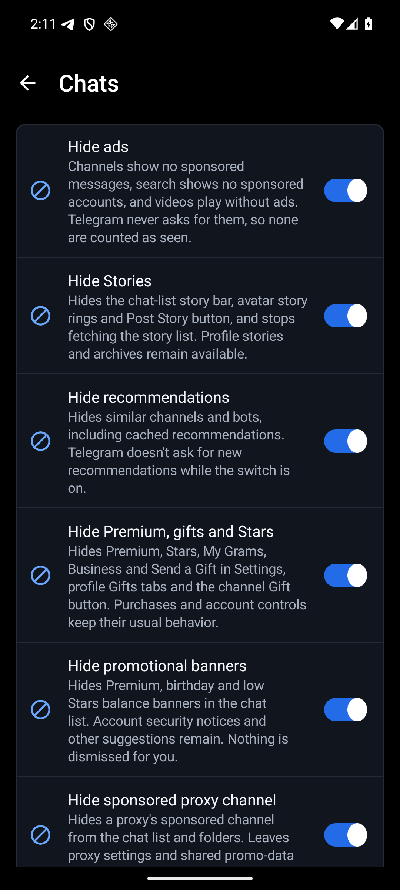

<p align="center">
  
  <a href="LICENSE"></a>
  
  
  
</p>

# HushTelegram

HushTelegram is a Morphe patch bundle for Android that takes the sponsored messages out of Telegram and keeps a few things on your phone that Telegram would otherwise send home.

It's early. There's no release yet, and the four patches below have been applied to Telegram 12.10.6 and run on a phone, but not yet with an account signed in.

## Why use it

- **Channels without sponsored messages.** Telegram never asks for them, so none are drawn, counted as seen or reported as clicked. The same goes for the ads in its video player.
- **Your storage stays your business.** When Telegram's server asks for a device statistics report, the patched app doesn't read your storage folders to build one.
- **No update offers that can't work.** telegram.org's build offers its own updates, and those can't install over a patched app. That offer is switched off, so you update through Morphe Manager instead.
- **Controls that recover.** Every feature has a switch, and there's a pause, settings backups and privacy-filtered diagnostics for when Telegram changes.

HushTelegram is the Telegram member of a small family of patch bundles. Its settings screen, diagnostics and release checks come from its Threads sibling, [HushThreads](https://github.com/SysAdminDoc/HushThreads). The Telegram patches are written here. See [Where the patches come from](#where-the-patches-come-from).

This project has no connection to Telegram or to the Morphe project. Neither endorses it, and neither wrote it.

## Which Telegram

HushTelegram patches the Telegram you download from [telegram.org](https://telegram.org/android), package `org.telegram.messenger.web`, version 12.10.6 (version code 71129). That APK carries every phone architecture, and it's the build each patch is checked against. Morphe Manager warns about other builds.

The other Telegram, `org.telegram.messenger`, shares nearly all its code with this one. Support for it is planned once it has its own checked build.

## Install

There's no release to install yet. Once there is:

1. Install [Morphe Manager](https://github.com/MorpheApp/morphe-manager) 1.32.0 or newer.
2. Add HushTelegram as a patch source.
3. Download Telegram 12.10.6 from telegram.org.
4. In Morphe Manager, pick that file, keep the default patch selection or change it, and patch.

A patched Telegram can't install over the stock one, because Android only accepts an update signed with the same key. Uninstall the stock Telegram first. Your chats live on Telegram's servers, so signing in again brings them back. Secret chats don't come back, since they only ever lived on that phone.

## Keep your signing key

Morphe Manager signs the patched Telegram with a key it makes on your phone. Android installs an update over your patched Telegram only when the update carries that same key.

- **Back it up right after your first patch.** In Morphe Manager, open Settings, then System, then Import & export, then Signing key, and tap Export. Keep the `Morphe.keystore` file somewhere private, because anyone who has it can sign an APK your phone will accept as an update.
- **On a new phone, import it before you patch anything.** Without your exported copy, nothing you patched earlier can be updated in place.

## Patches

There are 4 patches, and every one of them is selected by default.

| Patch | What it does |
|---|---|
| `Disable analytics` | Stops Telegram reading your storage folders and sending them to its server as a device statistics report. Everything the app needs to work is left alone. |
| `Disable update checks` | Stops telegram.org's Telegram offering its own updates, which can't install over a patched build. Patch the new version in Morphe Manager instead. |
| `Hide ads` | Hides the sponsored messages in channels and the ads in Telegram's video player. Telegram never asks for them, so none are counted as seen. |
| `HushTelegram settings` | Adds HushTelegram settings to Telegram. Long-press Telegram's launcher icon, or open Additional settings in the app on Telegram's App info page, to turn features on or off, pause HushTelegram, save your switches to a file or load them, and export diagnostics. The licenses are there too. |

## Settings

Long-press the Telegram icon and tap HushTelegram. You can also open Telegram's App info page and tap Additional settings in the app, which Samsung phones call Configure in Telegram.

<p></p>

## Notifications on a patched Telegram

This is the one thing to know before you switch. Telegram's push notifications go through Google's Firebase, and Google only hands them to an app signed with Telegram's own key. A patched Telegram is signed with yours, so Firebase turns it away and push doesn't arrive.

Telegram has its own fallback for phones without Google's services. Under Settings, Notifications and Sounds, turn on Keep-Alive Service and Background Connection, and Telegram keeps its own connection open instead. That costs some battery, and it hasn't been tried on a patched build with an account yet. A patch that lets Firebase accept the patched app is the next thing being worked on.

## Your Telegram account

**Can Telegram tell?** Assume it can. A patched Telegram is signed with your key rather than Telegram's, and Telegram's app reports a fingerprint of that key to its servers when it connects.

**What stays the same?** Your chats, contacts and calls work through Telegram's servers exactly as before. HushTelegram doesn't send, read, forward or delete messages on your behalf, and it doesn't change how you sign in.

**Could my account be limited?** Nobody can promise it won't be, and this project is young. If you'd rather not risk the account you care about, try HushTelegram with a second account first.

## What it won't do

Some patches other people publish for Telegram unlock Premium features, get past a channel's forward and save protection, or open content Telegram hides for age or legal reasons. HushTelegram won't ship any of those. They take away something someone else controls, and the first two take something people pay for.

## Privacy

HushTelegram doesn't collect anything and has no server. The patched app goes online on HushTelegram's behalf for one thing only: the release check, and it's off until you turn it on. Once it's on, HushTelegram asks `api.github.com` for its latest release at most once a day, when Telegram starts, and again whenever you tap Check now. That's a plain HTTPS request with `HushTelegram/<version>` as its User-Agent, and it carries no cookies and nothing about you or your phone. GitHub sees your IP address, as any site you visit does.

The About and Licenses screens link to `github.com`, `gitlab.com` and `www.gnu.org`. Those open in your browser, and only when you tap one.

## Where the patches come from

| Source | What came from it |
|---|---|
| [SysAdminDoc/HushThreads](https://github.com/SysAdminDoc/HushThreads) at `b141524` | The Gradle build, the shared extension library with its settings screen, diagnostics and pause, the bytecode helpers and the checks that apply every patch to real builds before a release. Most of that came to HushThreads from [Hushfacebook](https://github.com/SysAdminDoc/Hushfacebook), and some of it from [Hushfeed](https://github.com/SysAdminDoc/hushfeed), [Andrew Liang's patches](https://github.com/andrewliang25/morphe-patches) and [FroggoMorphePatches](https://github.com/SapitoSucio/FroggoMorphePatches). |
| [Morphe](https://github.com/MorpheApp) and [ReVanced](https://gitlab.com/ReVanced/revanced-patches) | The patcher and the patch template. Everything above grew from their code. |

The four Telegram patches were written for this project by reading Telegram 12.10.6 itself. Every source file says where it came from in its header, and [provenance.json](provenance.json) maps each file to the project and commit it came from, with its license. [docs/sources.md](docs/sources.md) covers the other Telegram patch sources: what each one does and what this bundle took from it.

## Building from source

You need JDK 17 or newer and the Android SDK. The Morphe patcher comes from GitHub Packages, so you also need a GitHub token with `read:packages`.

```bash
export GITHUB_ACTOR=<your GitHub user>
export GITHUB_TOKEN=<a token with read:packages>
./gradlew :patches:generatePatchesList
./gradlew :patches:buildAndroid
```

The bundle lands in `patches/build/release/patches-<version>.mpp`, beside its SHA-256 and a CycloneDX SBOM of every library that goes into it. Run `generatePatchesList` before `buildAndroid`, or the bundle loses its Android payload.

Tests: `./gradlew :patches:test :extensions:telegram:testDebugUnitTest`. [CONTRIBUTING.md](CONTRIBUTING.md) has the rest.

## License

[GPL-3.0](LICENSE), with the Morphe section 7 notices carried in [NOTICE](NOTICE). Telegram is a trademark of Telegram FZ-LLC.
